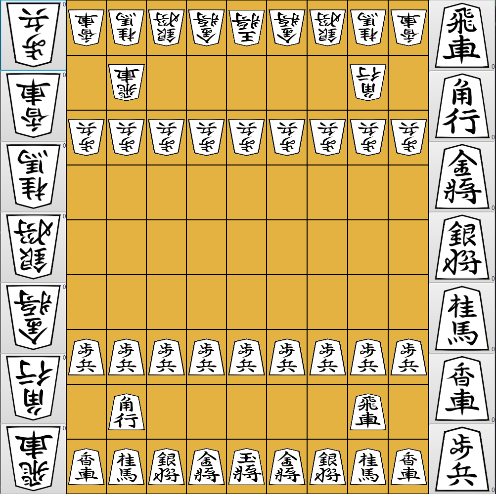

Shogi with javaFX
=====

Shogi, also known as "将棋" in Japanese, is a two-player strategy board game that has been played in Japan for centuries.
It is often referred to as "Japanese chess" due to its similarities to the Western game of chess, but has unique features that make it a distinct game in its own right.
This project is a representation of the game in Java.

